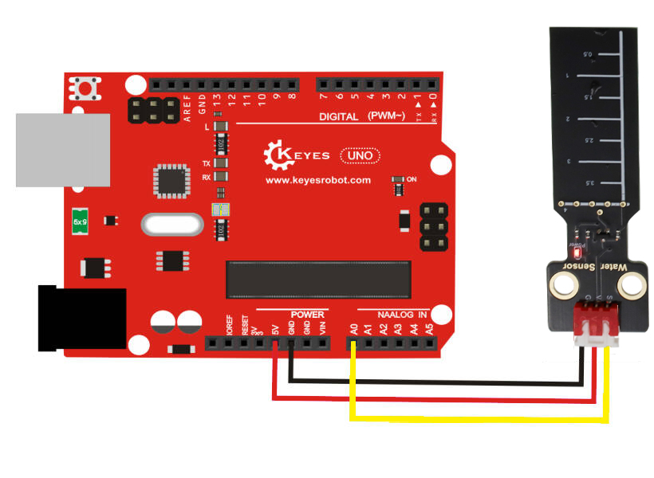
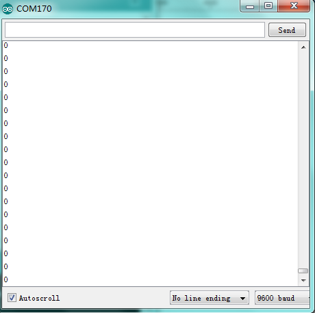
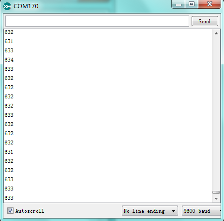

# KE0193 KEYES 水位传感器模块详细教程


## 1. 介绍
KE0193 KEYES 水位传感器是一款基于模拟信号输出的传感器模块，专为 Arduino 等开发板设计。它通过感应板上的焊盘孔检测液体的液位高度，并输出相应的模拟信号。设计简单，易于使用，适用于水位检测、液位报警等场景。


## 2. 特点
液位检测：通过感应板上的焊盘孔检测液体的液位高度。
模拟信号输出：通过 S 引脚输出液位高度的模拟电压值。
高兼容性：兼容 Arduino、树莓派等开发板。
环保设计：采用环保 PCB 板，耐用且稳定。
易于固定：模块自带两个定位孔，方便安装。


## 3. 规格参数
| 参数           | 值                 |
| -------------- | ------------------ |
| 工作电压       | 3.3V - 5V (DC)     |
| 工作电流       | <20mA              |
| 接口类型       | 3PIN接口 (GND,VCC,S) |
| 输出信号       | 模拟信号           |
| 检测范围       | 0-40mm (液位高度)  |
| 工作温度范围   | -10℃ ~ +70℃        |
| 重量           | 5.0g               |


## 4. 工作原理
KE0193 水位传感器模块通过感应板上的焊盘孔检测液体的液位高度。当液体接触到感应板上的焊盘时，模块的电阻值会发生变化，从而输出相应的模拟信号（S）。输出的电压值与液位高度成正比，液位越高，输出电压越高。


## 5. 接口描述


模块有3个引脚：

    1.GND：电源负极（接地）。
    
    2.VCC：电源正极（3.3V-5V）。
    
    3.S：模拟信号输出（连接开发板的模拟输入引脚）。

## 6. 连接图


| KE0037模块引脚 | Arduino引脚 |
| -------------- | ----------- |
| VCC            | 5V          |
| GND            | GND         |
| S              | A0          |
|||


## 7. Arduino

    以下是用于测试 KE0037 模块的 Arduino 示例代码：

```arduino
void setup() {
  Serial.begin(9600); // 设置串口波特率为9600
}

void loop() {
  int sensorValue = analogRead(A0); // 读取A0引脚的模拟信号值
  Serial.println(sensorValue); // 打印读取到的数值
  delay(500); // 延迟500ms
}
```


## 8. 实验现象

 1. 测试步骤:
    - 按照连接图接线，将模块连接到 Arduino。
    - 将代码烧录到 Arduino 开发板中。
    - 上电后，打开 Arduino IDE 的串口监视器，设置波特率为 9600。
    - 将传感器部分浸入液体中，观察串口监视器中显示的数值变化。


 2. 实验现象:
    - 当传感器未接触液体时，串口监视器显示的数值接近 0。
    
    - 当液体接触到传感器的焊盘时，串口监视器显示的数值逐渐增大。
    
    - 液位越高，显示的数值越大（最大值接近 1023，对应 5V）。


## 9. 注意事项

    1.电压范围：确保模块工作在 3.3V-5V 范围内，避免损坏模块。
    
    2.清洁传感器表面：使用后建议清洁传感器表面，避免液体残留影响检测效果。
    
    3.避免短路：传感器表面可能会有液体残留，使用时需注意避免引脚短路。
    
    4.固定模块：通过模块上的定位孔将其固定在稳定的位置，避免震动影响测试结果。
    
    5.液体类型：建议使用非腐蚀性液体进行测试，避免损坏传感器。


